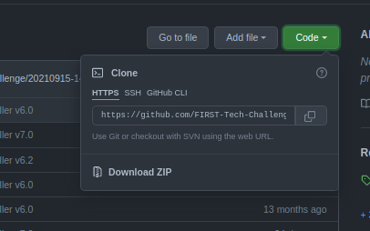
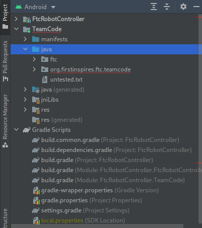

Note: Whenever \*nix is used here, it refers to operating systems which are somehow based off Unix, like Linux, BSD, and such (excluding Apple operating systems). If you didn't understand some of those words, don't worry: You don't have to.

# Development Environment

### Java

*This step can sometimes be ignored, since you'll already have Java if another app you have uses it.*

To start, you must first have Java installed. Java 8 or 11 should work, and if you can get Java 16, even better. Windows or MacOS users should go to [the Oracle site](https://www.oracle.com/java/technologies/downloads/) and follow the installation instructions for your OS. \*nix users should follow the distribution-dependent instructions for installing java.

### Android Studio

Android Studio is an "IDE", or Integrated Development Environment. It serves the same purpose as a text editor, but has "Integrations", such as code formatting or version control toolbar (TODO: Link this to version control page). The most relevant integration for FTC is donwloading programs onto Android devices.

To install Android Studio for Windows or MacOS computers, go to the [Android Studio](https://developer.android.com/studio/) site and follow the installation instructions for your OS. \*nix users should follow the distribution-dependent instructions for installing Android Studio.

You should definitely spend some time customizing and familiarizing yourself with Android Studio.

# Project Setup

### FTC Framework

Your entire project is based off the Qualcomm framework. To begin a new FTC project, copy all of the code from [the FTC repository](https://github.com/FIRST-Tech-Challenge/FtcRobotController) into your own project. You can do this by clicking the "Code" button, then clicking "Download ZIP", as shown.



It is better, though, to use Version Control to do this. This is discussed more in the Version Control section (TODO!!).

You can then start writing your code in (**and only in**) the `TeamCode/src/main/java` directory.

In addition, if you open the project in Android Studio and switch to Android project view as shown, you can navigate to `TeamCode/java` to get to the same directory.



### Evlib

The latest version of Evlib does not exist, as of yet, in its own repository. You can find a copy of it on the [ElectronVolts github page](https://github.com/ftc7393/FtcRobotController), on the `evlib-release` branch. Copy all the files in the `./Evlib` directory to the same location in your project, then update the `settings.gradle` file like so:
```diff
  include ':FtcRobotController'
  include ':TeamCode'
+ include ':Evlib'
```

We are currently working on an alternative method to install evlib using the same method as before. Check [the original page](../evlib/Importing-Into-Your-Project.md) for updates.
