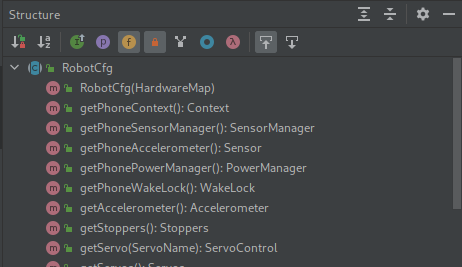

# Robot Config

In order to access hardware, the Qualcomm framework provides an object called the `hardwareMap`, which is helpful to think of as a `Map<String, HardwareDevice>`. You can access sensors and actuators from this object by calling the method `get(Class<? extends T>, String) -> T` on it.

ElectronVolts takes this a step further by making the abstract class `RobotCfg`, which will present all of the hardware that it knows about. By "present", I mean that you can ask explicitly for the hardware, using one of these functions.



(a side note: I call it hardware here, but it's really a reference to the hardware. As in, an object which you can use to change the hardware.)

For example, every FTC compatible phone will have an accelerometer built into itself, and every `RobotCfg` will also have an accelerometer built into itself. When you have a Robot Config, you can call `getAccelerometer() -> Accelerometer` on it and just start using it. Like this, we've reduced the amount of arguments you need from two to zero. That might seem small, but actually sitting down and writing long amounts of code can become a huge bottleneck. This code will take a bit of that load off the programmer's shoulders.

This is especially important because of the second use for Robot Configs: *it decouples the hardware team from the software team*. When the hardware team connects a device to the Robot's brain, that change needs to be reflected in the code. If the hardware specification and the software logic are in the same place, it makes it hard for both teams to read and write. With the Robot Config, the hardware team can declare in one place what hardware they are using in their robot, and the software team only has to read from one place to figure out what hardware is being used.

This also means that this section is great for *both hardware and software team* to understand.

**The library is still not magic**.

If you write code that isn't readable, then putting it all in one place won't necessarily make it better.

## Code

Start with a Robot Config like so:

```java
MyRobotCfg.java

import com.qualcomm.robotcore.hardware.HardwareMap;
import ftc.evlib.hardware.config.RobotCfg;

public class MyRobotCfg extends RobotCfg {
    public MyRobotCfg(HardwareMap hardwareMap) {
        super(hardwareMap);
    }

    @Override
    public void start() {}

    @Override
    public void act() {}

    @Override
    public void stop() {}
}

```

Right now, this config represents an empty bot. It has one brain, one phone, and that's it. This is already pretty powerful – without any custom logic, you have direct access to all the phone's sensors. This is sufficient for an abstract example, but what if we want to add motors to a bot?

Let's start by adding a simple DC motor to a bot, which on the robot core has been [programmed](https://github.com/FIRST-Tech-Challenge/FtcRobotController/wiki/Configuring-Your-Hardware) to be called "bruh":

```java
public class MyRobotCfg extends RobotCfg {
    public final DcMotor myMotor;

    public MyRobotCfg(HardwareMap hardwareMap) {
        super(hardwareMap);
        myMotor = hardwareMap.get(DcMotorEx.class, "bruh");
    }
}
```

Some code is not shown for conciseness.

This also works with the getter pattern, like so:

```java
public class MyRobotCfg extends RobotCfg {
    private final DcMotor myMotor;

    public DcMotor getMyMotor() {
        return myMotor;
    }

    public MyRobotCfg(HardwareMap hardwareMap) {
        super(hardwareMap);
        myMotor = hardwareMap.get(DcMotorEx.class, "bruh");
    }
}
```

Now, when you need the motor, and have a `MyRobotCfg`, you can call `myRobotCfg.getMyMotor()` to receive and move the motor.

The complete code should look like this:

```java
import com.qualcomm.robotcore.hardware.DcMotor;
import com.qualcomm.robotcore.hardware.DcMotorEx;
import com.qualcomm.robotcore.hardware.HardwareMap;
import ftc.evlib.hardware.config.RobotCfg;

public class MyRobotCfg extends RobotCfg {
    private final DcMotor myMotor;

    public DcMotor getMyMotor() {
        return myMotor;
    }

    public MyRobotCfg(HardwareMap hardwareMap) {
        super(hardwareMap);
        myMotor = hardwareMap.get(DcMotorEx.class, "bruh");
    }

    @Override
    public void start() {}

    @Override
    public void act() {}

    @Override
    public void stop() {}
}
```

This is all the code you need to move to the next step. If there is some other types of hardware you'd like to add, check out the [FTC javadoc](https://javadoc.io/doc/org.firstinspires.ftc), or see some more types we've made in the [Hardware section](../../hardware/index.html).
